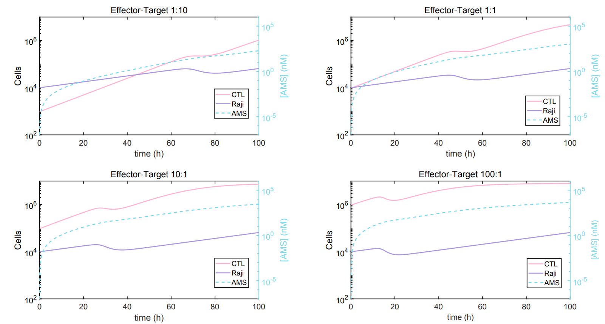

# SEAKERsim
Modeling the dynamics of a prodrug-secreting CAR-T cell platform.

## Introduction
CAR-T cell therapy has shown clinical promise in eradicating liquid malignancies[^1]. However, increasing evidence suggests engineering immunotherapies to combat solid tumors requires a multimodal approach[^2][^3]. The selective enzyme-activated killer [(SEAKER)](https://www.nature.com/articles/s41589-021-00932-1) system combines T cell prodrug therapies to synergistically eradicate tumor mass[^4]. SEAKER cells are tumor-targeted T cells that release a prodrug-activating enzyme, combining T cell cytolytic activity with local chemotherapy. The activity of SEAKER cells in the tumor represents a dynamic system. Tumor antigens stimulate T cells, promoting T cell proliferation and amplifying enzyme release (CPG), subsequently activating prodrug, P-AMS, to AMS which nonselectively kills both tumor and T cells. The differences in timescale and magnitude of each of the aforementioned conditional processes motivates simulating their time course under experimentally relevant conditions. The present work develops a first pass simulation of the SEAKER system in vitro to inform preclinical development by drawing conclusions about optimal SEAKER-tumor cell ratio, prodrug design, and enzyme selection.

## Approach
The SEAKER system was simulated with a mass action model to track the time courses of the relevant species and their cognate effects on each other. The mass action model is represented by a system of four coupled ordinary differential equations (ODEs), written in general form as:

$$
\begin{pmatrix} 
y_1'(t) \\ 
y_2'(t) \\
y_3'(t) \\
y_4'(t)
\end{pmatrix} = \begin{pmatrix} 
f(y_1(t), y_3(t)  \\ 
f(y_1(t), y_3(t)) \\
f(y_4(t), y_4'(t)) \\
f(t, y_1(t))
\end{pmatrix}
$$

Where CTL cell number, Raji (tumor target) cell number, fraction of killed cells of interest, and activated prodrug (AMS) concentration at any instant $t$ is represented by the solution to the ODE system, $y(t)$:

$$
y(t)=\begin{pmatrix} 
y_1(t) = \text{CTL [cells]} \\ 
y_2(t)=\text{Raji [cells]} \\
y_3(t)=\text{fraction of cells killed} \\
y_4(t)=\text{AMS [nM]}
\end{pmatrix}
$$

## Simulation Results
The time course of the SEAKER system in vitro was simulated from 0 to 100 hours by solving the ODE system in MATLAB. Briefly, the conditions recapitulate a 10 mL volume of culture in which 10^-4 Raji cells have been seeded at time 0 and were instantaneously subjected to CTLs at effector:target (E:T) ratios of 1:10, 1:1, 10:1, or 100:1 with 5.0 uM P-AMS. CTLs were assumed to be stimulated after 30 minutes, accounted for by a sudden change in doubling time (sec. 5.3). Figure 2 shows that CTL and AMS kill Raji cells at distinctly different timepoints for different E:T ratios. The roll-off observed in CTL and Raji traces in each panel indicates where [AMS]=f(t, CTL}(t)) has reached the $EC_{50}$ and effects an indiscriminate decrease in cell growth. Steady state values for CTL and Raji cell numbers occur significantly past the endpoint for an in vitro assay.

Justified application of the SEAKER system requires that CTL lytic activity and AMS toxicity synergize to kill Raji cells with sufficiently higher magnitude than either cytotoxic constituent alone. The following figure shows the effect of adding 0 nM or 5x10^10 nM P-AMS at time 0 with 10^4 Raji cells and CTLs (1:1 E:T). With the exception of notable roll-off starting at 40 hours, the AMS does not appear to have a significant effect on the the system over a 100 hour period with the model used. The unremarkable results of this example motivate a full analysis of the sensitivity of the model to the physical parameters of the system.

## Model Analysis
The physical parameters describing the SEAKER system (see Model Parameters) are numerous and vary in value, magnitude of effect, and times at which they have the most critical effect. As seen in the previous example, initial prodrug concentration appears to have an uninteresting impact on cell growth trajectories, and could potentially produce no difference between experimental and control groups if an in vitro assay's endpoint is before or after the critical point of impact. Systematic determination of the effect of each physical parameter in the model was done with a sensitivity analysis, performed by examining the derivatives of the system's solutions with respect to the parameter of interest, ex. the sensitivity of CTL growth to its growth constant, $k_1$, at any instant is given by $\frac{\partial \text{CTL}(t)}{\partial k_1}$.
This analysis was done on a simplified system, comprised of two coupled differential equations. The most notable simplification is that AMS killing rate was assumed to be constant, and thus the connectivity between CTL cell numbers and AMS concentration was lost. 

Solution dependence on each parameter does not require accurate parameter values within the context of a single panel. Furthermore, comparison between actual derivative values requires normalized, dimensionless parameters. However, the time-dependence of the sensitivity of the system on each trace is of notable importance; CTLs are extremely sensitive ($-10^7$) to AMS killing rate within the first 20 hours of incubation. The outcomes of this analysis also differ drastically with differing cell seed amounts and E:T (data not shown).

## Conclusions
Validation of this model with in vitro assays is still necessary to assess its predictive capabilities. A sufficient model fit under a limited set of conditions should enable the model to predict optimal endpoints at which maximal SEAKER activity can be observed. The current results from the model can only be examined comparatively, and no specific values should be considered given the reliance of the model on the outlined assumptions, which can be validated as in vitro results surface. This model has extensibility which allows adaptation for more specific cases, such as drug resistance[^5] and tumor microenvironment[^6]. Overall, the present work shows the process by which physical relationships can be used to elucidate the behavior of a complex system of interest and further guide experimental design.

## Appendix: Model Parameters
### ODE System
The SEAKER system was assumed to be determined by discrete, but not necessarily independent fluxes as follows:

$$
\begin{pmatrix} 
\frac{d\text{CTL}(t)}{dt} \\ 
\frac{d\text{Raji}(t)}{dt} \\
\frac{d\text{(Killed cell fraction)}(t)}{dt} \\
\frac{d\text{[AMS]}}{dt}
\end{pmatrix} = \begin{pmatrix} 
\text{(Natural logistic growth)} - \text{(Natural death)} - \text{(AMS killing)}\\ 
\text{(Natural logistic growth)} - \text{(CTL killing)} - \text{(AMS killing)} \\
\text{(Sigmoidal hill kinetics for EC$_{50}$)} \\
\text{(Formation from CPG-catalyzed P-AMS activation)}
\end{pmatrix}
$$

Specifically, the system is described by logistic growth, constant death rates, enzyme kinetics, and inferences from available cell viability data. The system was solved with MATLAB using ode15s.

$$
\begin{pmatrix} 
y_1'(t) \\ 
y_2'(t) \\
y_3'(t) \\
y_4'(t)
\end{pmatrix} = \begin{pmatrix} 
k_1y_1(t)(1-\frac{y_1(t)}{k_5}) - y_1(t)y_3'(t)\\ 
k_3y_2(t)(1-\frac{y_2(t)}{k_5}) - \frac{y_2(t)}{y_1(t)}e^{k_4t}) - y_2(t)y_3'(t) \\
\frac{5(\text{EC50})^5y_4'(t)}{(y_4(t)^6(\frac{\text{EC50}^5}{y_4(t)^5}) + 1)^2} \\
k_{cat}[\text{CPG}](t, y_1(t))\frac{\text{[P-AMS]}}{K_M+\text{[P-AMS]}}
\end{pmatrix}
$$

### Key assumptions
- The principle of mass action was assumed to govern formation and depletion rates of the system's constituents.
- Natural logistic growth was assumed for CTLs and Raji cells, where the carrying capacity is assumed to be the number of cells at confluency for a T-75 culture flask. Thus, the carrying capacity describes a 10 mL reaction volume.
- The doubling time of target cells was taken to be that of Raji cells; this parameter exclusively defines the phenotype of the target cells.
- $EC_{50}$ value previously observed for SET2s was used and a sigmoidal $EC_{50}$ curve was assumed to model the fraction of killed cells at an instant $t$. The derivative of the sigmoid $y_3'(t)$ was taken to be the fractional killing rate of cells by AMS.
- There is no latency between AMS formation and cell death.
- CTL cytolytic activity was assumed to follow first-order elimination kinetics[^7].
- P-AMS activation kinetics were assumed to follow the Michaelis-Menten model for a CMDA/CPG2 system[^8].

### Simplified ODE System for Analysis
The simplified system used in the model analysis is as follows:

$$
\begin{pmatrix} 
y_1'(t) \\ 
y_2'(t)
\end{pmatrix} = \begin{pmatrix} 
k_1y_1(t)(1-\frac{y_1(t)}{k_5}) - k_6y_1(t)\\ 
k_3y_2(t)(1-\frac{y_2(t)}{k_5}) - y_1(t)e^{k_4t}) - k_6y_2(t)
\end{pmatrix}
$$

where $k_1$, $k_3$, $k_4$, and $k_5$ are the same as before. The newly introduced $k_6$ potentially unjustifiably subsumes CPG formation, P-AMS activation, and subsequent AMS killing into a constant fractional killing rate of $5\%$ total cells/hr. Natural CTL death rate was not considered. Sensitivity analysis was performed using SENS_SYS, which uses ODE15s to solve the system and iterative approximation with directional derivatives to approximate sensitivity[^9][^10].

### Summary of Parameters

[^1]: Maude et al. (2014). N Engl J Med.
[^2]: Morgan et al. (2010). Mol Ther.
[^3]: Cameron et al. (2013). Sci Transl Med.
[^4]: Gardner et al. (2021). Nat Chem Biol.
[^5]: Cho & Levy. (2018). J Theor Biol.
[^6]: Jain. (1987). Cancer Res.
[^7]: Regoes et al. (2007). PNAS.
[^8]: Curiel & Douglas. (2005).
[^9]: Molla & Padilla. (2002).
[^10]: Maly & Petzold. (1996). Appl Num Math}.
